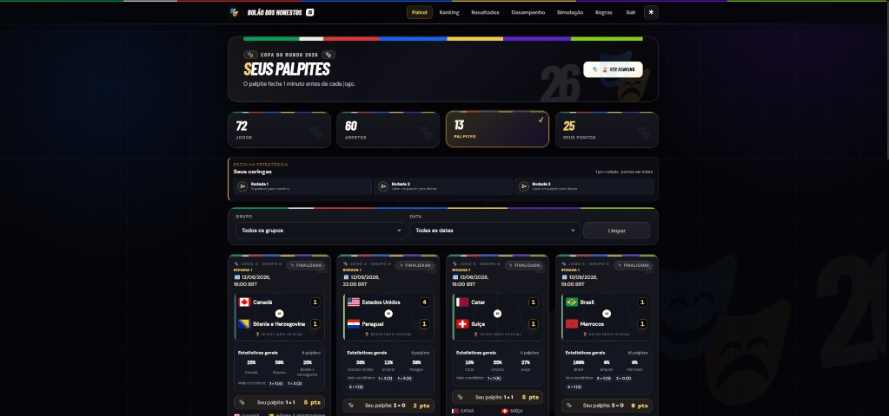
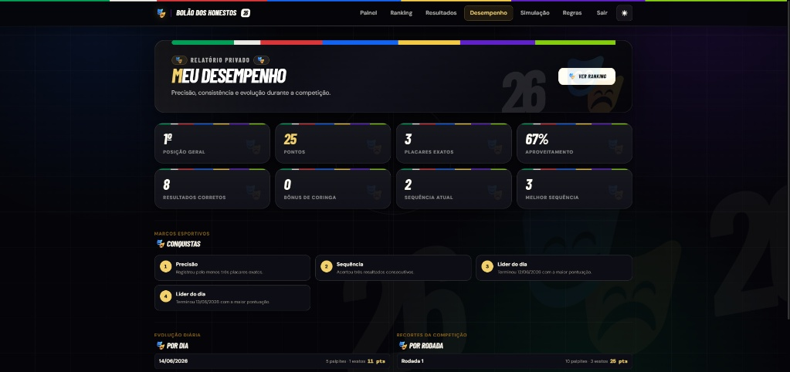
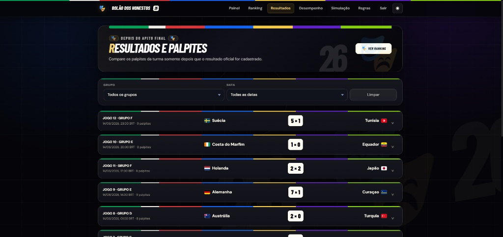
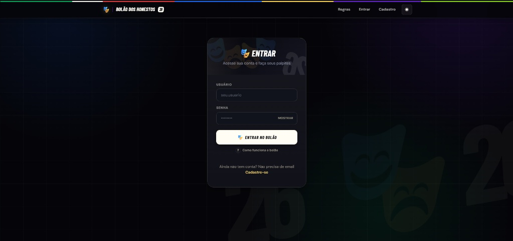

# Bolão dos Honestos ⚽

**Status:** Em produção | **Acesso:** [bolao.honestos.net](https://bolao.honestos.net)

O **Bolão dos Honestos** é uma plataforma web desenvolvida para gerenciar palpites e pontuações durante a Copa do Mundo. Construído com foco em segurança, performance e experiência do usuário, o sistema permite que grupos interajam de forma competitiva acompanhando os resultados do torneio em tempo real.

> **Aviso:** Este repositório é público apenas para fins de demonstração de portfólio e autoria. O código-fonte é proprietário e protegido por direitos autorais (All Rights Reserved). Não é permitida a cópia, modificação ou distribuição sem autorização prévia.

---

## O Projeto

A aplicação foi projetada para lidar com requisições simultâneas, atualizações de placares ao vivo e regras de pontuação dinâmicas, garantindo a integridade dos dados e a segurança das sessões dos usuários.

### Principais Funcionalidades
* **Gestão de Palpites:** Sistema de travas automático que impede alterações em palpites a partir de 1 minuto antes do início de cada partida.
* **Resultados em Tempo Real:** Integração assíncrona com APIs externas esportivas para ingestão e sugestão de placares oficiais, com revisão humana no painel administrativo.
* **Simulador de Mata-Mata:** Motor de simulação interativo permitindo a geração de chaves a partir das fases de grupos até a final.
* **Mecânicas Competitivas:** Implementação de "Coringas" por rodada (que dobram a pontuação), termômetros coletivos de palpites e rankings dinâmicos (geral, por dia e por rodada).
* **Dashboard Personalizado:** Área logada com estatísticas de desempenho, conquistas calculadas sob demanda e acompanhamento ao vivo.

---

## 🛠️ Tecnologias Utilizadas

**Backend & Lógica de Negócio**
* **Python 3.12**
* **Flask** (Roteamento, Sessões, Views)
* **SQLAlchemy / Flask-SQLAlchemy** (ORM e modelagem de dados)

**Frontend**
* **Jinja2** (Server-side rendering)
* **Bootstrap 5** (Design responsivo e componentes de UI)

**Infraestrutura & Banco de Dados**
* **PostgreSQL** (Produção via Render)
* **Gunicorn / WSGI** (Servidor de aplicação web)
* **Cloudflare** (DNS, Proxy HTTPS, WAF e CNAME flattening)

---

## Arquitetura de Segurança

A segurança foi um pilar central desde a concepção do projeto, implementando boas práticas de mercado para proteger os dados dos usuários e a integridade da competição:

* **Proteção de Dados em Repouso:** Dados sensíveis dos usuários são criptografados no banco de dados utilizando a biblioteca `cryptography` (Fernet).
* **Autenticação e Sessões:** Senhas protegidas com *hash* irreversível `bcrypt`. Os cookies de sessão utilizam `HttpOnly`, `SameSite=Lax` e `Secure`. IDs internos do banco nunca são expostos; a aplicação utiliza UUIDs públicos e aleatórios.
* **Defesas contra Ataques:**
    * Proteção global contra CSRF em todos os formulários POST.
    * *Rate limiting* customizado para proteção de rotas críticas (ex: `/login` bloqueia o IP/usuário por 5 minutos após 5 tentativas falhas).
    * Cabeçalhos HTTP rigorosos contra *framing*, *MIME sniffing* e acesso não autorizado a APIs do navegador.
* **Validação Restrita:** Todo dado de entrada (placares, IDs) passa por rigorosa validação antes de interagir com o ORM, prevenindo ataques de injeção e mantendo a consistência dos resultados.

## Telas da Aplicação

Uma prévia da interface do usuário, focada em usabilidade e design responsivo (Dark Mode nativo).

  
<b>Ver capturas de tela do sistema</b> (Clique para expandir)

   

  **Painel de Palpites e Gestão de Coringas**
  > Área principal onde o usuário gerencia seus palpites, visualiza estatísticas da comunidade e define multiplicadores.
  

  **Dashboard de Desempenho Privado**
  > Relatório individual com precisão, consistência, evolução diária e sistema de conquistas (achievements).
  

  **Acompanhamento de Resultados**
  > Tela para comparar os palpites da turma após o apito final e a confirmação do placar oficial.
  

  **Autenticação Segura**
  > Tela de login protegida com rate limit local.
  

